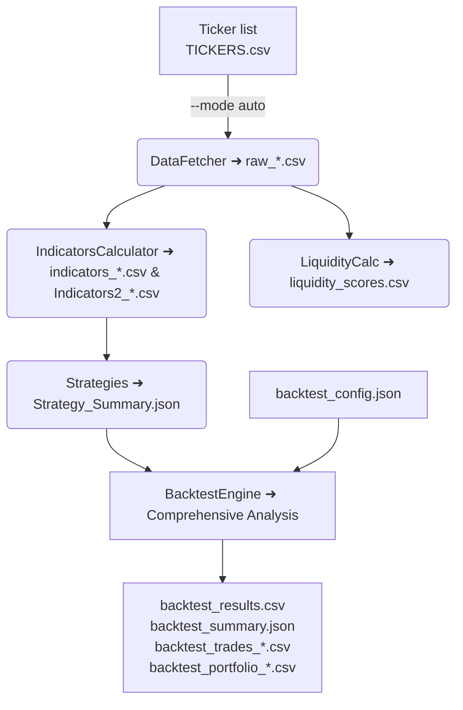

# ISX Auto Scraper

A comprehensive command-line tool written in Go that automates the complete workflow of gathering, enriching and analysing historical stock data for the Iraq Stock Exchange (ISX).  It is able to:

* Scrape daily trading data directly from the ISX web portal using a headless Microsoft Edge (Chromium) instance.
* Enrich the raw prices with more than 25 technical indicators (SMA, EMA, RSI, MACD, CMF, PSAR, ATR, …).
* **Interactive web dashboard** with professional candlestick charts and real-time market analysis.
* Evaluate a configurable set of trading rules and generate strategy sheets.
* Compute multi-factor liquidity scores for every listed share.
* **Run comprehensive backtesting with realistic portfolio management, risk controls, and performance analytics.**
* **Generate detailed trading reports including individual trades, portfolio history, and performance metrics.**
* Back-test or Monte-Carlo–simulate the included strategies with configurable parameters.


The project attempts to mirror the feature set of the original Python notebook while taking full advantage of Go's concurrency, static typing and single-binary distribution.

## Table of contents
- [Getting started](#getting-started)
- [Repository layout & file overview](#repository-layout--file-overview)
- [High-level data flow](#high-level-data-flow)
- [Contributing & future work](#contributing--future-work)

---

## Getting started

1. **Prerequisites**
   * Go 1.21 or later (`go env GOPATH` must be on your PATH)
   * A Chromium based browser driver (`msedgedriver.exe` is assumed on Windows)
   * Internet access to reach `http://www.isx-iq.net` while scraping

2. **Clone & build**
```bash
# clone
$ git clone <repo-url> && cd ISX-Auto-Scraper

# download dependencies
$ go mod tidy

# build static binary
$ go build -o isx-scraper.exe
```

3. **Run**
```bash
# minimal example – fetch data for one ticker interactively
$ ./isx-scraper.exe --mode single

# full unattended pipeline for every ticker in TICKERS.csv
$ ./isx-scraper.exe --mode auto
```

The `--mode` flag controls what the program does.  Valid values:

| mode            | description |
|-----------------|-------------|
| `web`           | **Interactive web dashboard** with real-time charts, technical analysis, and trading signals. |
| `single`        | Prompt for a ticker, then **fetch** only that one. |
| `auto`          | Full end-to-end pipeline for every ticker in `TICKERS.csv`. |
| `liquidity`     | Re-compute liquidity scores from already downloaded data. |
| `strategies`    | Re-run strategy sheets only. |
| `simulate`      | **Comprehensive backtesting** with portfolio management, risk controls, and detailed performance analytics. |
| `calculate`     | Enrich one ticker with **descriptive** indicators. |
| `calculate_num` | Enrich with **numeric-only** indicators (no textual explanations). |

---

## Repository layout & file overview

Below is a concise explanation of every first-class Go source file as well as the most important assets that live next to them:

| file | purpose |
|------|---------|
| `main.go` | CLI entry point powered by `spf13/cobra`.  Parses the `--mode` flag and orchestrates the high-level workflow. |
| `config.go` | Centralised immutable configuration (default URLs, driver paths, scraping time-outs, …).  Exposed through the global `AppConfig` instance. |
| `logger.go` | Very small wrapper around the standard library `log` package that prints to console **and** appends to `stock_analysis.log`. |
| `types.go` | All common data structures (price row, processing/timing reports, strategy results, …) with CSV tags for seamless serialisation via `gocarina/gocsv`. |
| `utils.go` | Generic helpers for working with CSV ticker files (`LoadTickers`, `LoadTickersWithInfo`). |
| `technical_indicators.go` | Pure-function implementations of every technical indicator used by the project (SMA, EMA, RSI, MACD, Stochastic, CMF, OBV, PSAR, ATR, rolling STD).  No I/O here. |
| `data_fetcher.go` | The web-scraper.  Uses `chromedp` to drive Microsoft Edge, navigate through pagination, handle pop-ups, wait for AJAX calls and finally export the table into `raw_<TICKER>.csv`.  Generates a detailed `ProcessingReport` and `TimingReport` for every run. |
| `indicators_calculator.go` | Heart of the analytics layer.  Reads `raw_*.csv`, calculates the full indicator set via `TechnicalIndicators`, detects cross-over events, attaches human readable descriptions, applies trading strategies and writes `indicators_<TICKER>.csv`. |
| `numerical_indicators_calculator.go` | Thin wrapper around `IndicatorsCalculator` that performs the same maths but **skips** the textual descriptions to keep the resulting `Indicators2_<TICKER>.csv` files lighter. |
| `liquidity_calculator.go` | Computes an **enhanced liquidity score** per ticker based on average volume, zero-volume days, intraday volatility and several other factors. Results are saved to `liquidity_scores.csv`. |
| `file_manager.go` | Generates fully-embedded HTML reports: CSS, JavaScript and PNG logo are base64-encoded so the output can be viewed offline. Relies on Go's `html/template` to populate placeholders. |
| `strategies.go` | Contains `Strategies` & `StrategyTester` helpers that rate indicator combinations, run back-tests or Monte-Carlo simulations and dump summaries as JSON / CSV. |
| `go.mod` / `go.sum` | Standard Go dependency manifests. |
| `*.csv` in repository root | Example raw data, ticker master list and previously calculated indicator / liquidity outputs. |
| `isx-auto-scraper.exe`, `isx-scraper.exe` | Pre-built windows binaries for convenience (may be stale). |

> **Note**: The Go sources are now organised under `cmd/` and `internal/` following a conventional layout. Earlier versions kept everything in the root package.

---

## High-level data flow



---

## Further reading

- [Mode Reference Guide](MODE_REFERENCE.md)
- [Web Dashboard Demo](DASHBOARD_DEMO.md)

## Contributing & future work

* Modularise the code into packages (`scraper`, `indicators`, `report`, …).
* Add unit tests for indicator calculations.
* Containerise with a lightweight **headless-shell** image so Linux users don't need a local Edge install.
* Replace raw CSV files by a SQLite database for faster random access.

Feel free to open issues or pull requests – happy hacking! 
